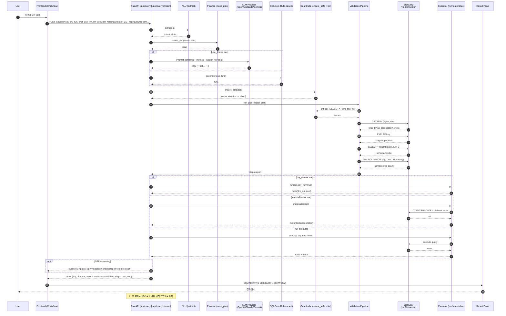
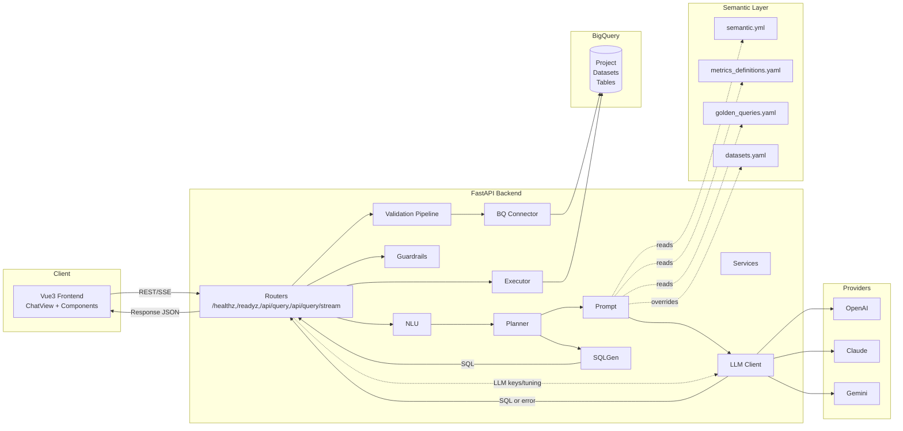
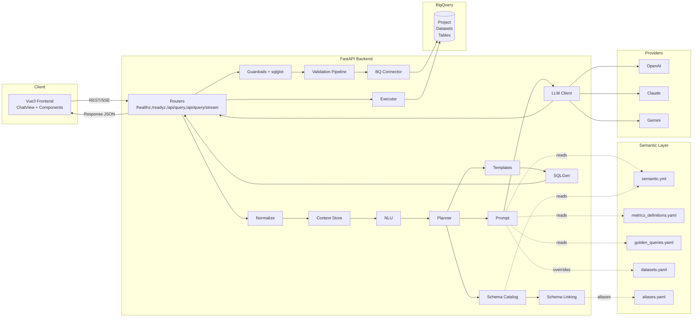

# codex-test

NL→SQL BigQuery 시멘틱 레이어 에이전트 + ChatGPT 스타일 프런트엔드.
FastAPI(백엔드)와 Vite+Vue3(프런트엔드)로 구성되어 자연어 질의를 SQL로 변환하고 실행/요약을 지원합니다.

## 프로젝트 구성
- `app/` 백엔드 FastAPI
  - `routers/` API 라우트 (`health.py`, `query.py` 등)
  - `services/` 코어 로직 (NLU/Planner/SQLGen/Validator/Executor/LLM/Prompt)
  - `semantic/` 시멘틱 모델 (`semantic.yml`, `metrics_definitions.yaml`, `golden_queries.yaml`)
  - `guardrails.json` 가드레일 정책(금칙어 등)
- `frontend/` Vite + Vue3 UI (ChatGPT 유사 인터랙션)
- `tests/` PyTest 기본 테스트
- `.github/` CI, PR 템플릿, CODEOWNERS

## 백엔드(FastAPI)
- 실행: `uvicorn app.main:app --host 0.0.0.0 --port 8080`
- API:
  - `GET /healthz`, `GET /readyz`
  - `POST /api/query` { q, limit?, dry_run?, use_llm? }
  - `GET /api/query/stream?q=...&limit=...&dry_run=...&use_llm=...` (SSE: nlu → plan → sql → validated → result)
- BigQuery:
  - 기본은 드라이런(`dry_run_only=true`)으로 비용/안전 보장
  - 실제 실행 시 GCP 인증과 `gcp_project`, `bq_default_location` 필요
  - DRY RUN 메타: `total_bytes_processed`, `estimated_tb`, `estimated_cost_usd`
- 가드레일: `app/guardrails.json` 기준으로 금칙어 검사(SELECT * 등)

## LLM 설정(OpenAI 기본, Claude/Gemini 지원)
- `.env` 예시(루트의 `.env.example` 참조):
  - `llm_provider=openai | claude | gemini`
  - OpenAI: `openai_api_key`, `openai_model`(기본 gpt-4o-mini)
  - Claude: `anthropic_api_key`, `anthropic_model`
  - Gemini: `gemini_api_key`, `gemini_model`
- 프롬프트에 시멘틱 레이어/메트릭/사전을 주입하여 SQL 정확도 향상

## 프런트엔드(Vite + Vue3)
- 설치/실행: `cd frontend && npm ci && npm run dev` (http://localhost:5173)
- 개발 프록시: `/api` → `http://localhost:8080` (`vite.config.ts`)
- 기능:
  - ChatGPT 스타일 대화, 스트리밍 진행(SSE), LLM 토글, Dry Run/Limit 제어
  - 결과 패널(페이지네이션/CSV 다운로드), 다크 모드
  - 고급 마크다운(목록/표) + 코드 하이라이트 + 수식(KaTeX) + 다이어그램(Mermaid)

## 테스트
- `pytest -q`

## 환경 템플릿
- 루트의 `.env.example`를 복사해 `.env`로 사용하세요. GCP/BigQuery 및 LLM(openai/claude/gemini) 키를 채운 뒤 서버를 재시작하면 적용됩니다.

- LLM 선택: 프런트엔드에서 Provider(OpenAI/Claude/Gemini)만 선택합니다. 키/토큰/튜닝(온도, 토큰)은 백엔드 .env 설정으로 관리하며, 제공자 호출 실패 시 서버 로그에 경고를 남기고 규칙 기반 SQL로 자동 폴백합니다.


- 검증 흐름: 규칙 린팅 → DRY RUN → EXPLAIN → LIMIT 0 스키마 → 카나리아 → 도메인 규칙 → 전체 실행/머티뷰.

- 실행 옵션: REST 바디 `materialize: true` 로 결과를 BigQuery 테이블로 머티리얼라이즈(만료시간 기본 24h, .env 설정).

- 시멘틱 테이블 경로 오버라이드: `app/semantic/datasets.yaml`에 엔티티별 BigQuery 테이블을 매핑하면 프롬프트와 검증에서 해당 경로로 사용됩니다.

- LLM 프롬프트의 few-shot: golden_queries.yaml에서 자연어 유사도가 높은 예시(NL/intent/slots)를 자동 포함해 SQL 품질을 높입니다.
## 프로젝트 폴더/파일 구성
```
.
├─ app/
│  ├─ bq/connector.py            # BigQuery 클라이언트/QueryJobConfig 헬퍼
│  ├─ config.py                  # Settings(.env): GCP/LLM/머티리얼라이즈/튜닝
│  ├─ deps.py                    # get_logger()
│  ├─ main.py                    # FastAPI 앱 팩토리/미들웨어
│  ├─ routers/
│  │  ├─ health.py               # /healthz, /readyz
│  │  └─ query.py                # /api/query, /api/query/stream (SSE)
│  ├─ semantic/
│  │  ├─ semantic.yml            # 엔티티/차원/지표/어휘
│  │  ├─ metrics_definitions.yaml# 메트릭 정의+기본필터
│  │  ├─ golden_queries.yaml     # 한국어 골든쿼리
│  │  ├─ datasets.yaml           # 엔티티→BQ 테이블 매핑
│  │  └─ loader.py               # 시멘틱 로더/오버라이드 적용
│  ├─ services/
│  │  ├─ nlu.py                  # extract()
│  │  ├─ planner.py              # make_plan()
│  │  ├─ sqlgen.py               # generate() 규칙기반 SQL
│  │  ├─ validator.py            # ensure_safe(), lint()
│  │  ├─ validation.py           # lint→dry_run→explain→schema→canary→assertions
│  │  ├─ executor.py             # run(), materialize()
│  │  ├─ prompt.py               # build_sql_prompt() + few-shot
│  │  └─ llm.py                  # generate_sql_via_llm()
│  └─ utils/timeparse.py         # last_n_days_utc()
├─ frontend/
│  ├─ index.html
│  ├─ vite.config.ts             # /api 프록시
│  ├─ package.json
│  └─ src/
│     ├─ App.vue                 # 레이아웃/다크모드/히스토리
│     ├─ main.ts                 # 부트스트랩(CSS 포함)
│     ├─ views/ChatView.vue      # 스트리밍/LLM 토글/전송 로직
│     ├─ components/
│     │  ├─ ChatInput.vue        # 입력/전송
│     │  ├─ ChatMessage.vue      # MD/KaTeX/Mermaid 렌더
│     │  └─ ResultPanel.vue      # 테이블/페이지네이션/CSV
│     └─ store/chat.ts           # 대화 저장/복원
├─ tests/                        # 기본 테스트
├─ .github/                      # CI/PR/CODEOWNERS
└─ AGENTS.md, README.md, .env.example
```

## 파일별 함수/클래스 개요(간단 주석)
- app/config.py
  - class Settings: GCP(BigQuery)/LLM(API Key, 모델, 온도/토큰/시스템프롬프트)/머티리얼라이즈 설정
- app/deps.py
  - get_logger(name, level): 구조화/스트림 로거 생성
- app/main.py
  - create_app(): FastAPI 앱 구성, 라우터/미들웨어 등록
- app/routers/health.py
  - healthz(), readyz(): 상태 점검 엔드포인트
- app/routers/query.py
  - class QueryRequest/QueryResponse: 요청/응답 모델
  - query(req): NLU→Plan→SQL(LLM/규칙)→검증파이프라인→실행/머티리얼라이즈
  - query_stream(...): 위 흐름을 SSE 이벤트(nlu/plan/sql/validated/check/result)로 스트리밍
- app/services/nlu.py
  - extract(q): 의도/슬롯(메트릭/기간 힌트) 추출(휴리스틱)
- app/services/planner.py
  - make_plan(intent, slots): 기본 grain/metric 보정, 계획 생성
- app/services/sqlgen.py
  - generate(plan, limit): BigQuery 방언 규칙 기반 SQL 생성
- app/services/validator.py
  - ensure_safe(sql): 변형/SELECT * 금지 등 가드레일 검사
  - lint(sql): 시간필터/SELECT * 등 린트 이슈 반환
- app/services/validation.py
  - StepResult, ValidationReport: 단계 결과/리포트 모델
  - lint_sql(), dry_run(), explain(), schema(), canary(): 단계별 검증 수행
  - domain_assertions(sql, plan): 시멘틱/메트릭 기반 도메인 규칙 검사
  - run_pipeline(sql, perform_execute, plan): 권장 검증 흐름 실행
- app/services/executor.py
  - class QueryResult: rows/meta 컨테이너
  - run(sql, dry_run): DRY RUN/실행 및 메타(비용추정 등) 반환
  - materialize(sql): 설정된 데이터셋에 결과 테이블 생성(만료시간 설정)
- app/services/prompt.py
  - build_sql_prompt(question, semantic): 시멘틱/메트릭/어휘+골든쿼리 few-shot 포함 프롬프트
- app/services/llm.py
  - generate_sql_via_llm(question, provider): OpenAI/Claude/Gemini로 SQL 생성, 코드펜스에서 추출
- app/semantic/loader.py
  - load_semantic_root(): 시멘틱/메트릭/골든쿼리 로딩
  - load_datasets_overrides(): datasets.yaml 읽기
  - apply_table_overrides(model, overrides): 엔티티 테이블 경로 치환
- app/bq/connector.py
  - available(), client(), base_job_config(), run_query(): BigQuery 실행 헬퍼
- app/utils/timeparse.py
  - last_n_days_utc(n): 최근 n일 UTC 구간 반환
- frontend/src/views/ChatView.vue
  - onSend(text): REST/SSE로 질의 전송, LLM/스트리밍/드라이런/리밋 반영
  - clear(): 안내 메시지 출력(새 채팅 유도)
- frontend/src/components/ChatMessage.vue
  - rendered(computed): marked+KaTeX+Mermaid 렌더, DOMPurify로 sanitize
- frontend/src/components/ResultPanel.vue
  - columns/paged(computed), downloadCsv(): 결과 표 렌더/CSV 저장, 페이지네이션
- frontend/src/components/ChatInput.vue
  - emitSend(): 엔터/버튼 전송
- frontend/src/store/chat.ts
  - types(Role/Message/Result/Conversation), newConversation(), selectConversation(), addMessage(), setResult(): 로컬스토리지 저장/복원
## Sequence Diagram


## Architecture Overview


## Sequence Diagram (Updated)

```mermaid
sequenceDiagram
    autonumber
    participant U as User
    participant FE as Frontend (ChatView)
    participant API as FastAPI (/api/query | /api/query/stream)
    participant NX as Normalize (preprocess)
    participant CTX as Context (conversation)
    participant NLU as NLU (extract)
    participant PL as Planner (make_plan)
    participant CAT as Schema Catalog
    participant LINK as Schema Linking
    participant PMT as Prompt (semantic + few-shot)
    participant LLM as LLM (OpenAI/Claude/Gemini)
    participant SG as SQLGen (Rule/Template)
    participant GRD as Guard (ensure_safe + lint + parse)
    participant PIPE as Validation Pipeline
    participant EXE as Executor (run/materialize)
    participant BQ as BigQuery (Connector)
    participant RPR as Repair (LLM)
    participant SUM as Summarize (LLM optional)
    participant UI as Result Panel

    U->>FE: 자연어 질의 입력
    FE->>API: POST /api/query {q, conv_id, use_llm, provider, dry_run, limit} / GET /api/query/stream
    API->>NX: normalize(q)
    NX-->>API: q_norm, meta
    API->>CTX: load(conversation_id)
    CTX-->>API: last_sql/plan (optional)
    API->>NLU: extract(q_norm)
    NLU-->>API: intent, slots
    API->>PL: make_plan(intent, slots)
    PL-->>API: plan
    API->>CAT: load catalog
    CAT-->>API: tables/columns
    API->>LINK: schema linking
    LINK-->>API: candidates, confidence

    alt use_llm == true
        API->>PMT: build semantic+few-shot prompt
        PMT->>LLM: chat.completions
        LLM-->>API: SQL (```sql ... ```)
    else
        API->>SG: generate(plan, limit)
        SG-->>API: SQL
    end

    API->>GRD: ensure_safe + lint + parse(sqlglot)
    GRD-->>API: ok or issues

    API->>PIPE: run_pipeline(sql, plan)
    PIPE-->>API: steps report (DRY RUN, EXPLAIN, SCHEMA, CANARY, ASSERTIONS)

    alt pipeline failed
        API->>RPR: attempt_repair(q_norm, sql, error, provider)
        RPR-->>API: fixed_sql?
        API->>GRD: re-validate fixed_sql
        API->>PIPE: re-run pipeline
    end

    alt dry_run == true
        API->>EXE: run(sql, dry_run=true)
        EXE-->>API: meta(dry_run,cost)
    else materialize == true
        API->>EXE: materialize(sql)
        EXE->>BQ: CTAS/TRUNCATE to dataset.table
        BQ-->>EXE: ok
        EXE-->>API: meta(destination table)
    else full execute
        API->>EXE: run(sql, dry_run=false)
        EXE->>BQ: execute query
        BQ-->>EXE: rows
        EXE-->>API: rows + meta
    end

    opt SSE streaming
        API-->>FE: event: normalize / context / nlu / plan / linking / sql / validated / check(step) / repair? / result
    end
    API-->>FE: JSON { sql, dry_run, rows?, metadata(validation_steps, linking, normalized, cost, summary, nl_summary?) }

    FE->>UI: 결과 패널 업데이트(페이지네이션/CSV)
    UI-->>U: 결과 표시
```
## Architecture Overview (Updated)


## Sequence Diagram (Logging markers)

```mermaid
sequenceDiagram
    autonumber
    participant U as User
    participant FE as Frontend (ChatView)
    participant API as FastAPI (/api/query)
    participant LOG as Logger (file)
    participant NX as Normalize
    participant CTX as Context
    participant NLU as NLU
    participant PL as Planner
    participant LINK as Schema Linking
    participant GEN as SQL Gen (LLM/Rule)
    participant GRD as Guard
    participant VAL as Validation Pipeline
    participant EXE as Executor

    U->>FE: 질의 입력
    FE->>API: POST /api/query
    API->>LOG: stage=start
    API->>NX: normalize
    NX-->>API: q_norm/meta
    API->>LOG: stage=normalize
    API->>CTX: load
    CTX-->>API: ctx
    API->>LOG: stage=context
    API->>NLU: extract
    NLU-->>API: intent/slots
    API->>LOG: stage=nlu
    API->>PL: make_plan
    PL-->>API: plan
    API->>LOG: stage=plan
    API->>LINK: schema_link
    LINK-->>API: candidates/conf
    API->>LOG: stage=linking
    API->>GEN: llm or rule
    GEN-->>API: sql
    API->>LOG: stage=llm_sql
    API->>GRD: ensure_safe + parse
    GRD-->>API: ok
    API->>LOG: stage=guard
    API->>VAL: run_pipeline
    VAL-->>API: steps report
    API->>LOG: stage=lint/dry_run/explain/schema/canary/assertions
    API->>EXE: run/materialize
    EXE-->>API: rows/meta
    API->>LOG: stage=end
    API-->>FE: JSON(sql, rows, metadata)
```
