# NL2SQL BigQuery Analytics Platform

**자연어를 BigQuery SQL로 변환하고 실행하는 엔터프라이즈급 분석 플랫폼**

FastAPI 백엔드와 Vite+Vue3 프론트엔드로 구성된 풀스택 NL2SQL 솔루션입니다.
LLM(OpenAI/Claude/Gemini)과 시맨틱 모델을 활용하여 정확한 SQL을 생성하고,
6단계 검증 파이프라인을 통해 안전하게 실행합니다.

---

## 🌟 주요 기능

### 🤖 하이브리드 LLM 아키텍처
- **다중 LLM 지원**: OpenAI (gpt-4o-mini), Anthropic (Claude), Google (Gemini)
- **하이브리드 전략**: 빠른 키워드 매칭 + LLM 보완
- **비용 최적화**: 간단한 질문은 무료, 복잡한 질문만 LLM 사용

### 📊 시맨틱 모델 기반
- **엔티티/차원/측정항목** 정의로 일관된 메트릭 관리
- **메트릭 정의**: SQL 표현식 및 기본 필터 중앙 관리
- **Few-shot 학습**: Golden queries로 SQL 생성 품질 향상
- **동의어 지원**: 다양한 표현을 표준 용어로 자동 변환

### 🛡️ 6단계 검증 파이프라인
1. **Lint**: SQL 품질 검사 (SELECT *, 시간 필터 등)
2. **Dry Run**: BigQuery 구문 검증 및 비용 추정
3. **Explain**: 쿼리 실행 계획 분석 (선택적)
4. **Schema**: 결과 스키마 추출 (LIMIT 0)
5. **Canary**: 샘플 실행으로 런타임 오류 감지
6. **Domain Assertions**: 시맨틱 모델 기반 비즈니스 규칙 검증

### 🔧 GA4 BigQuery Export 특화
- **테이블 서픽스 자동 처리**: `events_*` + `_TABLE_SUFFIX` 조건
- **네스티드 필드 지원**: `device.category`, `geo.country` 등
- **시간 범위 자동 계산**: "지난 7일" → `BETWEEN '20251031' AND '20251107'`
- **GA4 스키마 통합**: 공식 스키마 정보 프롬프트에 포함

### 💬 대화형 인터페이스
- **ChatGPT 스타일 UI**: 자연어 대화 기반
- **실시간 스트리밍**: SSE로 파이프라인 진행상황 실시간 표시
- **컨텍스트 유지**: 이전 대화 내용 참조 가능
- **마크다운 지원**: 결과를 표/차트로 시각화

### 🔒 보안 및 비용 관리
- **가드레일 정책**: DELETE, UPDATE, INSERT, DROP 차단
- **비용 제한**: `maximum_bytes_billed` 설정
- **Dry Run 모드**: 실제 실행 없이 비용 추정
- **쿼리 구체화**: 자주 사용하는 쿼리 결과 캐싱

---

### 고객 행동 네트워크 (NEW)
- 프론트 상단 패널에서 고객군(신규, 반복구매, VIP 등)을 선택하면 해당 세그먼트의 행동 네트워크를 즉시 렌더링합니다.
- 좌측 사이드바의 `고객 네트워크` 버튼을 누르면 네트워크 화면으로 전환되고, `챗 보기` 버튼을 누르면 기존 대화형 UI로 돌아갑니다.
- 백엔드는 `/api/network/customer-flow` 엔드포인트를 통해 BigQuery에 파라미터화된 WHERE 절을 구성하고 이벤트 간 이동 횟수를 집계한 뒤 `nodes + links` 형태로 응답합니다.
- 지원 파라미터: `segment`(필수), `start_date`/`end_date`(ISO, 기본 14일), `limit`(edge 개수 제한), `min_edge_count`(노이즈 필터).
- 세그먼트 목록은 `/api/network/customer-flow/segments` 로 조회할 수 있으며 프론트는 여기서 default 세그먼트를 선택합니다.

```json
POST /api/network/customer-flow
{
  "segment": "repeat_buyers",
  "start_date": "2025-10-15",
  "end_date": "2025-10-28"
}
```

```json
{
  "segment": {"id": "repeat_buyers", "label": "반복 구매 고객"},
  "nodes": [{"id": "product_detail", "label": "Product detail", "value": 620}],
  "links": [{"source": "product_detail", "target": "add_to_cart", "value": 310}],
  "summary": {"total_transitions": 1240, "edge_count": 5, "node_count": 6},
  "filters": {"start_date": "2025-10-15", "end_date": "2025-10-28", "limit": 25, "min_edge_count": 3}
}
```

수동 검증 순서:
1. `uv run fastapi dev` (또는 `uvicorn app.main:app --reload`) 로 백엔드를 실행합니다.
2. `cd frontend && npm install && npm run dev` 로 프론트를 띄웁니다.
3. UI 상단의 **고객 행동 네트워크** 패널에서 세그먼트를 바꾸고, 날짜/임계값을 조정해 그래프가 새로고침되는지 확인합니다.
4. 브라우저 개발자 도구에서 `/api/network/customer-flow` 호출 payload/response 를 확인하면 동일한 nodes/links 데이터를 받을 수 있습니다.

## 📁 프로젝트 구조

```
f:\codex\codex1\
├── app/                           # FastAPI 백엔드
│   ├── main.py                   # 애플리케이션 진입점
│   ├── config.py                 # 환경 설정 (Pydantic)
│   ├── deps.py                   # 로깅 설정
│   ├── guardrails.json           # 보안 정책
│   │
│   ├── routers/                  # API 엔드포인트
│   │   ├── health.py             # /healthz, /readyz
│   │   └── query.py              # /api/query, /api/query/stream
│   │
│   ├── services/                 # 비즈니스 로직 (12단계 파이프라인)
│   │   ├── normalize.py          # 텍스트 정규화
│   │   ├── context.py            # 대화 컨텍스트 관리
│   │   ├── nlu.py                # 자연어 이해 (하이브리드)
│   │   ├── planner.py            # 쿼리 계획 생성
│   │   ├── sqlgen.py             # LLM 기반 SQL 생성 (신규)
│   │   ├── llm.py                # LLM SQL 생성 (레거시)
│   │   ├── prompt.py             # LLM 프롬프트 빌더
│   │   ├── linking.py            # 스키마 링킹 (하이브리드)
│   │   ├── guard.py              # SQL 파싱 (SQLGlot)
│   │   ├── validator.py          # 보안 검사 및 린트
│   │   ├── validation.py         # 6단계 검증 파이프라인
│   │   ├── repair.py             # LLM 기반 오류 수정
│   │   ├── executor.py           # BigQuery 실행
│   │   ├── summarize.py          # 결과 요약
│   │   └── templates.py          # 템플릿 SQL
│   │
│   ├── bq/                       # BigQuery 통합
│   │   └── connector.py          # BigQuery 클라이언트 래퍼
│   │
│   ├── schema/                   # 스키마 관리
│   │   ├── catalog.py            # 테이블/컬럼 카탈로그 (캐싱)
│   │   └── aliases.yaml          # 한영 컬럼 별칭 매핑
│   │
│   ├── semantic/                 # 시맨틱 모델 (핵심!)
│   │   ├── semantic.yml          # 엔티티/차원/측정항목 정의
│   │   ├── metrics_definitions.yaml  # 메트릭 공식 및 필터
│   │   ├── golden_queries.yaml   # Few-shot 예제
│   │   ├── datasets.yaml         # 테이블명 오버라이드
│   │   ├── ga4_schema.yaml       # GA4 스키마 정의
│   │   └── loader.py             # YAML 로더
│   │
│   └── utils/
│       └── timeparse.py          # 날짜/시간 유틸리티
│
├── frontend/                     # Vite + Vue3 프론트엔드
│   ├── index.html
│   ├── vite.config.ts            # /api 프록시 설정
│   ├── package.json
│   └── src/
│       ├── App.vue               # 메인 레이아웃
│       ├── main.ts               # 엔트리포인트
│       ├── views/
│       │   └── ChatView.vue      # 채팅 인터페이스
│       ├── components/
│       │   ├── ChatInput.vue     # 입력 컴포넌트
│       │   ├── ChatMessage.vue   # 마크다운 렌더링 (KaTeX, Mermaid)
│       │   └── ResultPanel.vue   # 결과 테이블 (페이지네이션, CSV)
│       └── store/
│           └── chat.ts           # 대화 상태 관리
│
├── tests/                        # 테스트 스위트
│   ├── test_health.py
│   ├── test_query_stub.py
│   └── test_stream_sse.py
│
├── scripts/                      # 유틸리티 스크립트
│   └── stream_demo.py            # SSE 스트리밍 테스트
│
├── docs/                         # 문서
│   └── validation_architecture.md  # 검증 아키텍처 설명
│
├── logs/                         # 로그 파일 (자동 생성)
│   └── app.log
│
├── pyproject.toml                # Python 의존성
├── .env.example                  # 환경변수 템플릿
├── .env                          # 환경변수 (gitignore)
├── backend_analysis_report.md    # 백엔드 분석 보고서
└── README.md                     # 이 파일
```

---

## 🚀 빠른 시작

### 1. 환경 설정

```bash
# .env 파일 생성
cp .env.example .env

# .env 파일 편집 (필수)
# - GCP 프로젝트 설정
# - LLM API 키 설정 (최소 1개)
```

**.env 예시**:
```bash
# 환경
env=dev
gcp_project=your-gcp-project-id
bq_default_location=asia-northeast3

# LLM 프로바이더 (openai, claude, gemini 중 선택)
llm_provider=openai

# OpenAI 설정
openai_api_key=sk-...
openai_model=gpt-4o-mini

# BigQuery 설정
dry_run_only=true
maximum_bytes_billed=1000000000

# 로깅
log_file_path=logs/app.log
log_rotation=daily
```

### 2. 백엔드 실행

```bash
# 가상환경 생성 및 활성화
python -m venv venv
source venv/bin/activate  # Windows: venv\Scripts\activate

# 의존성 설치
pip install -e .

# 서버 실행
uvicorn app.main:app --host 0.0.0.0 --port 8080 --reload
```

**서버 실행 확인**:
```bash
curl http://localhost:8080/healthz
# {"status":"ok"}
```

### 3. 프론트엔드 실행 (선택적)

```bash
cd frontend

# 의존성 설치
npm install

# 개발 서버 실행
npm run dev
# → http://localhost:5173
```

### 4. 테스트

```bash
# Python 테스트
pytest -q

# SSE 스트리밍 테스트
python scripts/stream_demo.py
```

---

## 📡 API 엔드포인트

### Health Check

```bash
GET /healthz
GET /readyz
```

### Query (동기식)

```bash
POST /api/query
Content-Type: application/json

{
  "q": "지난 7일 디바이스별 방문자 수",
  "limit": 100,
  "dry_run": true,
  "use_llm": true,
  "llm_provider": "openai",
  "conversation_id": "session_123",
  "materialize": false
}
```

**응답**:
```json
{
  "sql": "SELECT device.category, COUNT(DISTINCT user_pseudo_id) AS users...",
  "dry_run": true,
  "rows": null,
  "metadata": {
    "validation_steps": [...],
    "total_bytes_processed": 75832225,
    "estimated_cost_usd": 0.000345,
    "linking": {...},
    "summary": "행 수: 0 | 예상비용: $0.000345"
  }
}
```

### Query Stream (SSE)

```bash
GET /api/query/stream?q=지난 7일 주문 추이&limit=10&dry_run=true
```

**SSE 이벤트**:
```
event: normalize
data: {"text_len": 11, "meta": {"normalized": true}}

event: context
data: {"keys": []}

event: nlu
data: {"intent": "metric_over_time", "slots": {...}}

event: plan
data: {"intent": "metric_over_time", "metric": "orders", "grain": "day"}

event: sql
data: {"sql": "SELECT...", "source": "semantic_llm", "provider": "openai"}

event: linking
data: {"confidence": 0.9, "candidates": [...]}

event: validated
data: {"ok": true}

event: check
data: {"name": "lint", "ok": true, ...}

event: check
data: {"name": "dry_run", "ok": true, "meta": {"total_bytes_processed": 75832225}}

event: result
data: {"sql": "...", "dry_run": true, "rows": null, "metadata": {...}}
```

---

## 🧠 12단계 NL2SQL 파이프라인

```
자연어 질문
    ↓
[1] Normalize - 텍스트 정규화 및 동의어 치환
    ↓
[2] Context - 대화 컨텍스트 로드
    ↓
[3] NLU - 의도 및 슬롯 추출 (하이브리드: 키워드 + LLM)
    ↓
[4] Planner - 실행 계획 생성 (시맨틱 모델 기반 검증)
    ↓
[5] SQL Generation - LLM 기반 동적 SQL 생성
    │   ├─ GA4 테이블 서픽스 자동 처리
    │   ├─ 시맨틱 모델 메트릭 정의 활용
    │   └─ 대화 컨텍스트 반영
    ↓
[6] Schema Linking - 스키마 요소 매칭 (하이브리드: 토큰 + LLM)
    ↓
[7] Guard - SQL 파싱 (SQLGlot) 및 가드레일
    ↓
[8] Validation - 6단계 검증 파이프라인
    ↓
[9] Repair - LLM 기반 오류 자동 수정 (선택적)
    ↓
[10] Execute - BigQuery 실행 (Dry Run / Full / Materialize)
    ↓
[11] Summarize - 결과 요약 (규칙 기반 + LLM)
    ↓
[12] Response - 클라이언트에 응답 반환
```

---

## 🎯 시맨틱 모델

### semantic.yml - 엔티티 및 차원 정의

```yaml
entities:
  - name: event
    grain: event_id
    table: `project.dataset.events_*`
    dimensions:
      - name: event_date
      - name: event_name
      - name: user_pseudo_id
    measures:
      - name: events
        expr: COUNT(*)

  - name: session
    grain: session_id
    dimensions:
      - name: device_category  # → device.category (GA4)
      - name: source_medium    # → traffic_source.medium
    measures:
      - name: sessions
        expr: COUNT(DISTINCT session_id)

# NLU 키워드 (하이브리드 매칭)
nlu_keywords:
  intents:
    metric_over_time: ['추이', 'trend', '변화']
  metrics:
    orders: ['주문', 'orders', '구매']
    users: ['사용자', '방문자', 'users']

# Planner 설정
planner_config:
  valid_intents: [metric, metric_over_time, comparison, aggregation]
  defaults:
    metric: orders
    grain: day

# GA4 스키마 (네스티드 필드)
ga4_schema:
  nested_fields:
    device:
      - category: "device.category"
      - operating_system: "device.operating_system"
    geo:
      - country: "geo.country"
      - city: "geo.city"

common_dimensions:
  디바이스별: "device.category"
  국가별: "geo.country"
```

### metrics_definitions.yaml - 메트릭 공식

```yaml
metrics:
  - name: gmv
    description: 총 거래액
    expr: SUM(ecommerce.purchase_revenue)
    default_filters:
      - event_name = 'purchase'

  - name: orders
    description: 주문 건수
    expr: COUNT(DISTINCT ecommerce.transaction_id)
    default_filters:
      - event_name = 'purchase'
```

### golden_queries.yaml - Few-shot 예제

```yaml
queries:
  - nl: "지난 7일 주문 추이"
    intent: metric_over_time
    slots:
      metric: orders
      time_window: {days: 7}
      grain: day

  - nl: "디바이스별 방문자 수"
    intent: aggregation
    slots:
      metric: users
      group_by: [device_category]
```

---

## 🔧 설정

### LLM 프로바이더 설정

```bash
# .env 파일

# OpenAI (권장)
llm_provider=openai
openai_api_key=sk-...
openai_model=gpt-4o-mini

# 또는 Claude
llm_provider=claude
anthropic_api_key=sk-ant-...
anthropic_model=claude-3-5-sonnet-20240620

# 또는 Gemini
llm_provider=gemini
gemini_api_key=AIza...
gemini_model=gemini-1.5-flash

# LLM 파라미터
llm_temperature=0.1
llm_max_tokens=2048
llm_enable_repair=true
llm_enable_result_summary=false
```

### BigQuery 설정

```bash
# GCP 프로젝트
gcp_project=your-project-id
bq_default_location=asia-northeast3

# 비용 제한 (바이트 단위)
maximum_bytes_billed=10000000000  # 10GB

# Dry Run 전용 모드 (안전)
dry_run_only=true

# 가격 설정 (TB당 USD)
price_per_tb_usd=5.0
```

### 로깅 설정

```bash
# 로그 파일
log_file_path=logs/app.log

# 로테이션 방식
log_rotation=daily  # 또는 size

# 로그 레벨
log_level=INFO

# UTC 시간 사용
log_utc=false
```

---

## 💻 사용 예시

### cURL

```bash
# 간단한 질문 (키워드 매칭)
curl -X POST http://localhost:8080/api/query \
  -H "Content-Type: application/json" \
  -d '{"q": "지난 7일 주문 추이", "dry_run": true}'

# 복잡한 질문 (LLM 사용)
curl -X POST http://localhost:8080/api/query \
  -H "Content-Type: application/json" \
  -d '{
    "q": "작년 동기 대비 올해 모바일 고객의 평균 구매액 증가율",
    "use_llm": true,
    "llm_provider": "openai",
    "dry_run": false
  }'

# SSE 스트리밍
curl "http://localhost:8080/api/query/stream?q=지난+7일+주문+추이&dry_run=true"
```

### Python

```python
import httpx

# 동기식 쿼리
response = httpx.post("http://localhost:8080/api/query", json={
    "q": "디바이스별 시간대별 방문자 수",
    "limit": 100,
    "dry_run": True
})

result = response.json()
print(result["sql"])
print(result["metadata"]["estimated_cost_usd"])

# SSE 스트리밍
async with httpx.AsyncClient() as client:
    async with client.stream(
        "GET",
        "http://localhost:8080/api/query/stream",
        params={"q": "지난 7일 주문 추이", "dry_run": "true"}
    ) as response:
        async for line in response.aiter_lines():
            print(line)
```

---

## 📊 아키텍처 다이어그램

### 시스템 아키텍처

```
┌─────────────────┐
│  Vue3 Frontend  │
│   (ChatGPT UI)  │
└────────┬────────┘
         │ REST/SSE
         ↓
┌─────────────────────────────────────────┐
│         FastAPI Backend                  │
│  ┌────────────────────────────────────┐ │
│  │  12단계 NL2SQL 파이프라인            │ │
│  │  1. Normalize → 2. Context →       │ │
│  │  3. NLU → 4. Planner →             │ │
│  │  5. SQL Gen → 6. Linking →         │ │
│  │  7. Guard → 8. Validation →        │ │
│  │  9. Repair → 10. Execute →         │ │
│  │  11. Summarize → 12. Response      │ │
│  └────────────────────────────────────┘ │
│                                          │
│  ┌────────────────────────────────────┐ │
│  │  시맨틱 모델 (YAML)                  │ │
│  │  - 엔티티/차원/측정항목              │ │
│  │  - 메트릭 공식 및 필터               │ │
│  │  - Few-shot 예제                    │ │
│  │  - GA4 스키마                        │ │
│  └────────────────────────────────────┘ │
└──────┬──────────────────────┬───────────┘
       │                      │
       ↓                      ↓
┌──────────────┐      ┌──────────────┐
│  LLM APIs    │      │  BigQuery    │
│  - OpenAI    │      │  - Events    │
│  - Claude    │      │  - Orders    │
│  - Gemini    │      │  - Sessions  │
└──────────────┘      └──────────────┘
```

---

## 🎨 주요 모듈 설명

### 백엔드 서비스

| 모듈 | 역할 | 하이브리드 | 파일 |
|------|------|----------|------|
| **normalize** | 텍스트 정규화, 동의어 치환 | - | normalize.py |
| **context** | 대화 컨텍스트 관리 | - | context.py |
| **nlu** | 의도/슬롯 추출 | ✅ 키워드 + LLM | nlu.py |
| **planner** | 쿼리 계획, 검증 | - | planner.py |
| **sqlgen** | SQL 생성 (신규) | LLM 기반 | sqlgen.py |
| **linking** | 스키마 매칭 | ✅ 토큰 + LLM | linking.py |
| **guard** | SQL 파싱, 가드레일 | - | guard.py |
| **validator** | 보안/품질 검사 | - | validator.py |
| **validation** | 6단계 파이프라인 | - | validation.py |
| **executor** | BigQuery 실행 | - | executor.py |

### 시맨틱 레이어

| 파일 | 역할 |
|------|------|
| semantic.yml | 엔티티, 차원, 측정항목, NLU 키워드, GA4 스키마 |
| metrics_definitions.yaml | 메트릭 공식 및 기본 필터 |
| golden_queries.yaml | Few-shot 학습 예제 |
| datasets.yaml | 테이블명 오버라이드 |
| ga4_schema.yaml | GA4 네스티드 필드 상세 정의 |
| aliases.yaml | 한영 컬럼 별칭 매핑 |

---

## 🔍 GA4 BigQuery Export 지원

### 네스티드 필드 자동 처리

**질문**: "디바이스별 국가별 방문자 수"

**생성 SQL**:
```sql
SELECT
  device.category AS device_category,  -- 네스티드 필드!
  geo.country AS country,               -- 네스티드 필드!
  COUNT(DISTINCT user_pseudo_id) AS users
FROM `project.dataset.events_*` AS e
WHERE _TABLE_SUFFIX BETWEEN '20251031' AND '20251107'
GROUP BY device.category, geo.country
ORDER BY users DESC
LIMIT 100
```

### 테이블 서픽스 자동 계산

| 질문 | _TABLE_SUFFIX 조건 |
|------|-------------------|
| "어제" | `= '20251106'` |
| "지난 7일" | `BETWEEN '20251031' AND '20251107'` |
| "최근 30일" | `BETWEEN '20251008' AND '20251107'` |

---

## 🧪 테스트

```bash
# 전체 테스트
pytest

# 특정 테스트
pytest tests/test_query_stub.py -v

# 커버리지
pytest --cov=app --cov-report=html
```

---

## 📖 문서

- [backend_analysis_report.md](backend_analysis_report.md) - 백엔드 아키텍처 상세 분석
- [docs/validation_architecture.md](docs/validation_architecture.md) - 검증 파이프라인 설명
- [app/semantic/ga4_schema.yaml](app/semantic/ga4_schema.yaml) - GA4 스키마 레퍼런스

---

## 🛠️ 개발 가이드

### 새로운 메트릭 추가

```yaml
# semantic.yml
metrics:
  - name: revenue
    expr: SUM(ecommerce.purchase_revenue_in_usd)
    default_filters:
      - event_name = 'purchase'
```

→ 코드 변경 없이 즉시 사용 가능!

### 새로운 NLU 키워드 추가

```yaml
# semantic.yml
nlu_keywords:
  metrics:
    revenue:
      - '수익'
      - 'profit'
      - '이익'
```

→ 서버 재시작만으로 적용!

### 커스텀 LLM 프롬프트

```python
# .env
llm_system_prompt=You are a BigQuery SQL expert specializing in GA4 analytics.
```

---

## 🚨 문제 해결

### OpenAI API 오류

**오류**: `Unsupported parameter: 'max_tokens'`

**해결**: gpt-4o 모델은 `max_completion_tokens` 사용 (자동 처리됨)

### BigQuery 연결 오류

**오류**: `BigQuery client not installed`

**해결**:
```bash
pip install google-cloud-bigquery
```

### 가드레일 위반

**오류**: `GuardrailViolation: query violates guardrail policy`

**원인**: DELETE, UPDATE, INSERT, DROP, SELECT * 사용

**해결**: `guardrails.json` 정책 확인 및 SQL 수정

---

## 📈 성능 최적화

### 캐싱 전략
- **시맨틱 모델**: 메모리 캐시 (재로드 불필요)
- **카탈로그**: TTL 30분
- **BigQuery 결과**: 구체화(materialize) 옵션

### 비용 절감
- **Dry Run 우선**: 무료 구문 검증
- **Early Exit**: 검증 실패 시 즉시 중단
- **LIMIT 사용**: Schema(0), Canary(100)

### 하이브리드 전략
- **간단한 질문**: 키워드 매칭 (무료, 빠름)
- **복잡한 질문**: LLM 호출 (유료, 정확)

---

## 🤝 기여 가이드

### 브랜치 전략
- `main`: 프로덕션
- `develop`: 개발
- `feature/*`: 기능 개발

### 커밋 메시지
```
feat: 새로운 메트릭 추가
fix: GA4 네스티드 필드 오류 수정
docs: README 업데이트
refactor: SQL 생성 로직 개선
```

---

## 📝 라이선스

MIT License

---

## 👥 작성자

AI-powered NL2SQL Platform

---

## 🔗 참고 자료

- [FastAPI 공식 문서](https://fastapi.tiangolo.com/)
- [BigQuery 표준 SQL](https://cloud.google.com/bigquery/docs/reference/standard-sql/query-syntax)
- [GA4 BigQuery Export 스키마](https://support.google.com/analytics/answer/7029846)
- [SQLGlot 문서](https://sqlglot.com/)

---

## 🎯 로드맵

### v1.0 (현재)
- ✅ 12단계 NL2SQL 파이프라인
- ✅ 다중 LLM 지원
- ✅ GA4 네스티드 필드 처리
- ✅ 하이브리드 아키텍처

### v1.1 (예정)
- ⏳ 다중 테이블 JOIN 자동 생성
- ⏳ 임베딩 기반 스키마 링킹
- ⏳ Redis 기반 컨텍스트 저장
- ⏳ 쿼리 캐싱

### v2.0 (장기)
- ⏳ 자동 쿼리 최적화
- ⏳ 시각화 자동 생성
- ⏳ 다국어 지원 확대
- ⏳ 실시간 데이터 스트리밍

---

## 📐 상세 Sequence Diagram

### 전체 자연어 질의 처리 흐름 (함수 레벨)

```mermaid
sequenceDiagram
    autonumber
    participant User
    participant ChatView as Frontend<br/>ChatView.vue
    participant API as FastAPI<br/>query.py

    box Services Layer
    participant NX as normalize.py<br/>normalize()
    participant CTX as context.py<br/>get_context()
    participant NLU as nlu.py<br/>extract()
    participant PL as planner.py<br/>make_plan()
    participant SG as sqlgen.py<br/>generate()
    participant LINKING as linking.py<br/>schema_link()
    participant GRD as guard.py<br/>parse_sql()
    participant VAL as validator.py<br/>ensure_safe()
    participant PIPE as validation.py<br/>run_pipeline()
    participant EXE as executor.py<br/>run()
    participant SUM as summarize.py<br/>summarize()
    end

    participant LLM as LLM API<br/>OpenAI/Claude/Gemini
    participant BQ as BigQuery<br/>API

    User->>ChatView: 질문 입력: "디바이스별 시간대별 방문자 수"
    ChatView->>API: POST /api/query/stream

    Note over API: 1. 텍스트 정규화
    API->>NX: normalize(q)
    NX->>NX: 공백 정리, 동의어 치환
    NX-->>API: (normalized_text, meta)
    API-->>ChatView: event: normalize

    Note over API: 2. 대화 컨텍스트 로드
    API->>CTX: get_context(conversation_id)
    CTX-->>API: {last_sql, last_plan}
    API-->>ChatView: event: context

    Note over API: 3. 자연어 이해 (하이브리드)
    API->>NLU: extract(normalized_text, use_llm=True)
    NLU->>NLU: _extract_keyword_based(q)
    NLU->>NLU: _calculate_confidence(intent, slots)

    alt confidence < 0.7
        NLU->>LLM: _call_openai(prompt)<br/>"의도와 슬롯 추출"
        LLM-->>NLU: {intent, slots} JSON
    end

    NLU-->>API: (intent, slots)
    API-->>ChatView: event: nlu

    Note over API: 4. 쿼리 계획 생성
    API->>PL: make_plan(intent, slots, validate=False)
    PL->>PL: _load_semantic_config()
    PL->>PL: 기본값 적용 (metric, grain)
    PL-->>API: plan {intent, metric, grain, slots}
    API-->>ChatView: event: plan

    Note over API: 5. SQL 생성 (LLM 기반)
    API->>SG: generate(plan, question, limit, llm_provider)
    SG->>SG: _determine_table_suffix()<br/>날짜 범위 계산
    SG->>SG: _analyze_required_tables()<br/>테이블 분석
    SG->>SG: _build_sql_generation_prompt()<br/>시맨틱 모델 + GA4 스키마
    SG->>LLM: _call_openai_for_sql(prompt)<br/>"BigQuery SQL 생성"
    LLM-->>SG: SQL 문자열
    SG->>SG: _post_process_sql()<br/>코드 블록 제거, LIMIT 추가
    SG-->>API: SQL
    API-->>ChatView: event: sql

    Note over API: 6. 스키마 링킹 (하이브리드)
    API->>LINKING: match schema elements
    LINKING->>LINKING: token based matching<br/>토큰 + 별칭 + 동의어 매칭

    alt confidence < 0.6
        LINKING->>LLM: llm based matching<br/>"스키마 요소 매칭"
        LLM-->>LINKING: {candidates, confidence} JSON
    end

    LINKING-->>API: {candidates, confidence, method}
    API-->>ChatView: event: linking

    Note over API: 7. 가드레일 검사
    API->>GRD: parse_sql(sql)
    GRD->>GRD: sqlglot.parse_one(sql, "bigquery")
    GRD-->>API: AST or None

    API->>VAL: ensure_safe(sql)
    VAL->>VAL: _load_policy()<br/>guardrails.json 로드
    VAL->>VAL: 위험 키워드 검사<br/>(DELETE, UPDATE, DROP 등)
    VAL-->>API: ok or GuardrailViolation
    API-->>ChatView: event: validated {ok: true}

    Note over API: 8. 검증 파이프라인 (6단계)
    API->>PIPE: run_pipeline(sql, plan, logger)

    rect rgb(240, 248, 255)
    Note over PIPE: 8-1. Lint 검사
    PIPE->>VAL: lint(sql)
    VAL->>VAL: SELECT * 검사
    VAL->>VAL: 시간 필터 검사
    VAL-->>PIPE: StepResult(lint, ok, issues)
    PIPE-->>ChatView: event: check {name: "lint"}
    end

    rect rgb(240, 255, 240)
    Note over PIPE: 8-2. Dry Run
    PIPE->>BQ: run_query(sql, dry_run=True)
    BQ-->>PIPE: total_bytes_processed
    PIPE-->>ChatView: event: check {name: "dry_run", meta: {bytes}}
    end

    rect rgb(255, 250, 240)
    Note over PIPE: 8-3. Explain (선택적)
    PIPE->>BQ: run_query("EXPLAIN " + sql)
    BQ-->>PIPE: execution plan or error
    PIPE-->>ChatView: event: check {name: "explain"}
    end

    rect rgb(255, 240, 245)
    Note over PIPE: 8-4. Schema 추출
    PIPE->>BQ: run_query("SELECT * FROM (...) LIMIT 0")
    BQ-->>PIPE: schema [name, type, mode]
    PIPE-->>ChatView: event: check {name: "schema"}
    end

    rect rgb(248, 248, 255)
    Note over PIPE: 8-5. Canary 실행
    PIPE->>BQ: run_query("SELECT * FROM (...) LIMIT 100")
    BQ-->>PIPE: sample rows
    PIPE-->>ChatView: event: check {name: "canary"}
    end

    rect rgb(245, 255, 250)
    Note over PIPE: 8-6. Domain Assertions
    PIPE->>PIPE: domain_assertions(sql, plan)
    PIPE->>PIPE: 메트릭 필터 검증
    PIPE->>PIPE: GROUP BY 검증
    PIPE->>PIPE: 시간 버킷팅 검증
    PIPE-->>ChatView: event: check {name: "assertions"}
    end

    PIPE-->>API: ValidationReport {steps, sql, schema}

    Note over API: 9. 최종 실행

    alt dry_run == true
        API->>EXE: run(sql, dry_run=True)
        EXE->>BQ: dry_run query
        BQ-->>EXE: {bytes, cost, job_id}
        EXE-->>API: QueryResult {rows: null, meta}
    else materialize == true
        API->>EXE: materialize(sql)
        EXE->>BQ: CREATE TABLE ... AS SELECT ...
        BQ-->>EXE: destination_table
        EXE-->>API: QueryResult {rows: null, meta}
    else full execute
        API->>EXE: run(sql, dry_run=False)
        EXE->>BQ: execute query
        BQ-->>EXE: rows []
        EXE-->>API: QueryResult {rows, meta}
    end

    Note over API: 10. 결과 요약
    API->>SUM: summarize(rows, meta)
    SUM-->>API: summary_text

    opt llm_enable_result_summary == true
        API->>SUM: summarize_llm(question, sql, meta)
        SUM->>LLM: "자연어 요약 생성"
        LLM-->>SUM: nl_summary
        SUM-->>API: nl_summary
    end

    Note over API: 11. 컨텍스트 업데이트
    API->>CTX: update_context(conv_id, {last_sql, last_plan})
    CTX-->>API: ok

    Note over API: 12. 응답 반환
    API-->>ChatView: event: result<br/>{sql, dry_run, rows, metadata}
    ChatView->>ChatView: 결과 렌더링<br/>ResultPanel.vue
    ChatView-->>User: SQL + 테이블 표시

    Note over User,BQ: 전체 처리 시간: 3-8초<br/>비용: $0.0001 ~ $1.00 (쿼리 크기에 따라)
```



### 함수 호출 체인 (상세)

```mermaid
sequenceDiagram
    autonumber
    participant Q as query.py::query_stream()

    box normalize.py
    participant N1 as normalize()
    end

    box context.py
    participant C1 as get_context()
    participant C2 as update_context()
    end

    box nlu.py
    participant NLU1 as extract()
    participant NLU2 as _extract_keyword_based()
    participant NLU3 as _calculate_confidence()
    participant NLU4 as _extract_llm_based()
    participant NLU5 as _call_openai()
    end

    box planner.py
    participant P1 as make_plan()
    participant P2 as _load_semantic_config()
    participant P3 as _validate_intent()
    participant P4 as _validate_metric()
    end

    box sqlgen.py
    participant S1 as generate()
    participant S2 as _determine_table_suffix()
    participant S3 as _analyze_required_tables()
    participant S4 as _build_sql_generation_prompt()
    participant S5 as _format_ga4_schema_for_prompt()
    participant S6 as _call_llm_for_sql()
    participant S7 as _call_openai_for_sql()
    participant S8 as _post_process_sql()
    end

    box linking.py
    participant L1 as schema_link()
    participant L2 as _schema_link_token_based()
    participant L3 as _schema_link_llm_based()
    end

    box validator.py
    participant V1 as ensure_safe()
    participant V2 as lint()
    participant V3 as _load_policy()
    end

    box validation.py
    participant VP1 as run_pipeline()
    participant VP2 as lint_sql()
    participant VP3 as dry_run()
    participant VP4 as schema()
    participant VP5 as canary()
    participant VP6 as domain_assertions()
    end

    box executor.py
    participant E1 as run()
    end

    participant BQ as BigQuery API

    Q->>N1: normalize(q)
    N1-->>Q: (text, meta)

    Q->>C1: get_context(conv_id)
    C1-->>Q: context dict

    Q->>NLU1: extract(text, use_llm=True)
    NLU1->>NLU2: _extract_keyword_based(q)
    NLU2-->>NLU1: (intent, slots)
    NLU1->>NLU3: _calculate_confidence(q, intent, slots)
    NLU3-->>NLU1: confidence

    alt confidence < 0.7
        NLU1->>NLU4: _extract_llm_based(q)
        NLU4->>NLU5: _call_openai(prompt)
        NLU5-->>NLU4: JSON response
        NLU4-->>NLU1: (llm_intent, llm_slots)
    end

    NLU1-->>Q: (intent, slots)

    Q->>P1: make_plan(intent, slots, validate=False)
    P1->>P2: _load_semantic_config()
    P2-->>P1: config dict

    opt validate == True
        P1->>P3: _validate_intent(intent, config)
        P1->>P4: _validate_metric(metric, config)
    end

    P1-->>Q: plan dict

    Q->>S1: generate(plan, question, limit, llm_provider)
    S1->>S2: _determine_table_suffix(plan, question, context)
    S2-->>S1: {use_wildcard, start_date, end_date, suffix_condition}

    S1->>S3: _analyze_required_tables(plan, semantic_model)
    S3-->>S1: [{entity, table, alias, is_primary}]

    S1->>S4: _build_sql_generation_prompt(...)
    S4->>S5: _format_ga4_schema_for_prompt(semantic_model)
    S5-->>S4: GA4 schema info
    S4-->>S1: complete prompt

    S1->>S6: _call_llm_for_sql(prompt, provider)
    S6->>S7: _call_openai_for_sql(prompt)
    S7->>BQ: OpenAI API call
    BQ-->>S7: SQL text
    S7-->>S6: SQL
    S6-->>S1: SQL

    S1->>S8: _post_process_sql(sql, limit)
    S8-->>S1: cleaned SQL
    S1-->>Q: final SQL

    Q->>L1: match schema
    L1->>L2: token based
    L2-->>L1: results

    alt confidence < 0.6
        L1->>L3: llm based
        L3->>BQ: LLM API call
        BQ-->>L3: results
        L3-->>L1: LLM result
    end

    L1-->>Q: final results

    Q->>V1: ensure_safe(sql)
    V1->>V3: _load_policy()
    V3-->>V1: guardrails policy
    V1->>V1: 키워드 검사 (DELETE, DROP 등)
    V1-->>Q: ok or exception

    Q->>VP1: run_pipeline(sql, plan, logger)

    VP1->>VP2: lint_sql(sql)
    VP2->>V2: lint(sql)
    V2-->>VP2: issues []
    VP2-->>VP1: StepResult(lint)

    VP1->>VP3: dry_run(sql)
    VP3->>BQ: connector.run_query(sql, dry_run=True)
    BQ-->>VP3: job {total_bytes_processed}
    VP3-->>VP1: StepResult(dry_run)

    VP1->>VP4: schema(sql)
    VP4->>BQ: SELECT * FROM (...) LIMIT 0
    BQ-->>VP4: schema [{name, type, mode}]
    VP4-->>VP1: StepResult(schema)

    VP1->>VP5: canary(sql)
    VP5->>BQ: SELECT * FROM (...) LIMIT 100
    BQ-->>VP5: rows []
    VP5-->>VP1: StepResult(canary)

    VP1->>VP6: domain_assertions(sql, plan)
    VP6->>VP6: 메트릭 필터 검증
    VP6->>VP6: GROUP BY 검증
    VP6->>VP6: 시간 버킷팅 검증
    VP6-->>VP1: StepResult(assertions)

    VP1-->>Q: ValidationReport {steps, sql, schema}

    Q->>E1: run(sql, dry_run)
    E1->>BQ: execute query or dry_run
    BQ-->>E1: rows + metadata
    E1-->>Q: QueryResult {rows, meta}

    Q->>SUM: summarize(rows, meta)
    SUM-->>Q: summary text

    Q->>C2: update_context(conv_id, {last_sql, last_plan})
    C2-->>Q: ok

    Q-->>ChatView: event: result {sql, rows, metadata}
    ChatView-->>User: 결과 테이블 표시

    Note over User,BQ: 각 단계별 로그: 시간 : 파일 : 함수 : 레벨 : 메시지
```



### 하이브리드 전략 상세 흐름

```mermaid
flowchart TD
    Start([자연어 질문]) --> Normalize[1. normalize.normalize<br/>동의어 치환]

    Normalize --> NLUKeyword[2. nlu keyword based<br/>키워드 매칭]

    NLUKeyword --> NLUConf{3. nlu confidence<br/>신뢰도 >= 0.7?}

    NLUConf -->|Yes| Plan[4. planner make plan<br/>빠른 처리]
    NLUConf -->|No| NLULLM[3b. nlu llm based<br/>LLM 호출]

    NLULLM --> Plan

    Plan --> SQLGen[5. sqlgen generate<br/>LLM SQL 생성]

    SQLGen --> TableSuffix[5a. determine suffix<br/>날짜 범위 계산]
    TableSuffix --> Prompt[5b. build prompt<br/>시맨틱 모델 + GA4 스키마]
    Prompt --> LLMSQL[5c. call openai<br/>LLM 호출]
    LLMSQL --> PostProcess[5d. post process<br/>정리]

    PostProcess --> LinkToken[6. schema matching token<br/>토큰 + 별칭 매칭]

    LinkToken --> LinkConf{신뢰도 >= 0.6?}

    LinkConf -->|Yes| Guard[7. guard parse<br/>SQLGlot 파싱]
    LinkConf -->|No| LinkLLM[6b. schema matching llm<br/>LLM 호출]

    LinkLLM --> Guard

    Guard --> Safe[8. ensure safe<br/>가드레일]
    Safe --> Lint[9. lint check<br/>품질 검사]

    Lint --> Pipeline[10. run validation<br/>6단계 검증]

    Pipeline --> Pipe1[10a. lint]
    Pipe1 --> Pipe2[10b. dryrun]
    Pipe2 --> Pipe3[10c. explain]
    Pipe3 --> Pipe4[10d. get schema]
    Pipe4 --> Pipe5[10e. canary test]
    Pipe5 --> Pipe6[10f. assertions]

    Pipe6 --> Execute[11. execute query<br/>BigQuery 실행]

    Execute --> Summarize[12. summarize<br/>결과 요약]

    Summarize --> Response([응답 반환])

    style NLUKeyword fill:#e1f5ff
    style NLULLM fill:#fff4e1
    style LinkToken fill:#e1f5ff
    style LinkLLM fill:#fff4e1
    style LLMSQL fill:#ffe1f5
    style Pipeline fill:#f0f0f0
```



### 각 모듈의 주요 함수

| 모듈 | 주요 함수 | 입력 | 출력 |
|------|----------|------|------|
| **normalize.py** | `normalize(text)` | str | (normalized_text, meta) |
| **context.py** | `get_context(conv_id)` | str | dict |
| | `update_context(conv_id, patch)` | str, dict | None |
| **nlu.py** | `extract(q, use_llm)` | str, bool | (intent, slots) |
| | `_extract_keyword_based(q)` | str | (intent, slots) |
| | `_calculate_confidence(q, intent, slots)` | str, str, dict | float |
| | `_extract_llm_based(q)` | str | (intent, slots) |
| **planner.py** | `make_plan(intent, slots, validate)` | str, dict, bool | plan dict |
| | `_load_semantic_config()` | - | config dict |
| | `_validate_metric(metric, config)` | str, dict | None or raise |
| **sqlgen.py** | `generate(plan, question, limit, provider, conv_id)` | dict, str, int, str, str | SQL str |
| | `_determine_table_suffix(plan, question, context)` | dict, str, dict | suffix_info dict |
| | `_build_sql_generation_prompt(...)` | multiple | prompt str |
| | `_call_openai_for_sql(prompt)` | str | SQL str |
| **linking.py** | `schema_link(question, use_llm)` | str, bool | {candidates, confidence, method} |
| | `_schema_link_token_based(question)` | str | {candidates, confidence} |
| | `_schema_link_llm_based(question)` | str | {candidates, confidence} |
| **guard.py** | `parse_sql(sql)` | str | AST or None |
| **validator.py** | `ensure_safe(sql)` | str | None or raise |
| | `lint(sql)` | str | issues [] |
| **validation.py** | `run_pipeline(sql, perform_execute, plan, logger)` | str, bool, dict, logger | ValidationReport |
| | `lint_sql(sql)` | str | StepResult |
| | `dry_run(sql)` | str | StepResult |
| | `schema(sql)` | str | StepResult |
| | `canary(sql, limit_rows)` | str, int | StepResult |
| | `domain_assertions(sql, plan)` | str, dict | StepResult |
| **executor.py** | `run(sql, dry_run)` | str, bool | QueryResult |
| | `materialize(sql)` | str | QueryResult |
| **summarize.py** | `summarize(rows, meta)` | list, dict | str |
| | `summarize_llm(question, sql, meta, provider)` | str, str, dict, str | str |

---

**Made with ❤️ using FastAPI, Vue3, and LLM**
